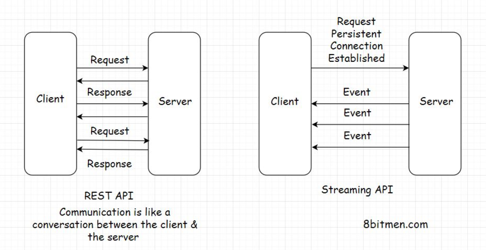

# Buổi 19
- Tìm hiểu về cách phát triển các chức năng realtime
- Tìm hiểu và sử dụng Socket IO

# HTTP Pull vs HTTP Push
## HTTP Pull
Từ trước tới giờ, ta đều sử dụng Rest API là cơ chế HTTP Pull.

Client **pull** dữ liệu từ server khi cần. Client sẽ chủ động gọi tới Server và nhận kết quả. 

Client sẽ không biết được khi nào Server update dữ liệu mới, Server cũng không thể thông báo ngược lại Client.

Công nghệ sử dụng cơ chế HTTP Pull là Asynchronous JavaScript & XML (AJAX)

## HTTP Push
Một số Web App có một số chức năng realtime. Ví dụ như chat app, game online multiplayer hay thông báo (notification), ... Khi có dữ liệu mới, Server cần thông báo được cho Client để client cập nhật.

Khi này ta sử dụng cơ chế HTTP Push. Trong cơ chế này, Client sẽ gửi một request tới Server một lần duy nhất. Sau request đó, connection sẽ được giữ lại và Server sẽ **push** dữ liệu cho Client mỗi khi có dữ liệu mới

Một số công nghệ sử dụng HTTP Push là:
- Ajax Long Polling
- WebSocket
- HTML5 Event Source
- Streaming over HTTP



# SocketIO
SocketIO là một thư viện để cài đặt chức năng realtime, giao tiếp 2 chiều (bidirectional communication) giữa Client và Server

Cơ chế sử dụng trong Socket IO là Ajax Long Polling và Websocket. Trong đó, Client sẽ cố gắng sử dụng cơ chế Websocket nếu không được (do trình duyệt cũ không hỗ trợ hoặc do Server cấu hình chặn protocal WebSocket) thì sẽ chuyển sang Ajax Long Polling

`Chú ý: SocketIO không phải là WebSocket, nó chỉ là một thư viện sử dụng cơ chế WebSocket thôi`

Để sử dụng được SocketIO thì ta phải lập trình ở cả 2 phía Client và Server

## SocketIO in Server
Thư viện sử dụng
```
npm install socket.io
```

Cài đặt Server tiếp nhận cả cơ chế HTTP Push. Đoạn code dưới chỉ dùng khi sử dụng Express là framework web server.

```
const express = require("express");
const { createServer } = require("http");
const { Server } = require("socket.io");

const app = express();
const httpServer = createServer(app);
const io = new Server(httpServer, {
  cors: {
    origin: "*",
  }
);

io.on("connection", (socket) => {
  console.log('socket connected', socket.id);
  socket.on('disconnect', () => {
    console.log('socket disconnected');
  });
});

httpServer.listen(3000);
```

## Socket In Client
Thư viện sử dụng
```
npm i socket.io-client
```
Cài đặt ở client

```
import { io } from "socket.io-client";

const socket = io(process.env.REACT_APP_SOCKET_SERVER);
```

## Giao tiếp giữa Client-Server và Server-Client

SocketIO cung cấp cơ chế event-based communication, có nghĩa là bên gọi emit (phát) ra một event và bên nhận lắng nghe event đó

```
// Server gọi, Client lắng nghe
// server-side
io.on("connection", (socket) => {
  socket.emit("hello", "world");
});

// client-side
socket.on("hello", (arg) => {
  console.log(arg); // world
});
```

```
// Client gọi, Server lắng nghe
// server-side
io.on("connection", (socket) => {
  socket.on("hello", (arg) => {
    console.log(arg); // world
  });
});

// client-side
socket.emit("hello", "world");
```

Tóm lại quá trình giao tiếp như sau:
Client gọi request lên Server và giữ kết nối
Dựa vào kết nối này
- Client cần gửi thông tin cho Server => Client emit, Server lắng nghe (on)
- Server cần gửi thông tin cho Client => Server emit, 
Client lắng nghe (on)

## Room
Bình thường khi Server emit data thì sẽ có một hoặc nhiều client cùng lắng nghe (nhận) data đó, phụ thuộc vào function emit Server gọi

Toàn bộ cách emit từ Server được gói gọn ở đây
https://socket.io/docs/v4/emit-cheatsheet/

Room là một cơ chế đặc biệt của SocketIO để quy định tập hợp các client được lắng nghe data.

Socket khi kết nối tới Server sẽ có quyền join (vào) hoặc leave(rời) một hoặc nhiều room


```
io.on("connection", (socket) => {
  socket.join("some room");
});
```

Thông thường, các chức năng của webapp sẽ xoay quanh tính năng Room này vì hiếm khi server broadcast cho tất cả client mà cần broadcast với đúng client cần lắng nghe, phù hợp với nghiệp vụ ấy

Một user muốn nhận thông báo của mình => Cho client join vào room `notification:${userId}`

Các user muốn nhận comment mới của bài post => Cho các client user đó join vào room `post:${postId}`

Hai user muốn chat với nhau => Tạo ra một conversationId (giữa 2 người) => Cho 2 user join vào room `conversation:${conversationId}`

Nhiều user muốn chat với nhau => Tạo một conversationId gồm nhiều người => Cho toàn bộ user join vào room `conversation:${conversationId}`

### Khi nào thì join Room
Thông thường để một socket join một room thì ta cần có một sự kiện để gọi hàm join.

Sự kiện đó thường là:
Bên Server: khi connection hoặc khi authenticated thành công

```
io.on("connection", (socket) => {
  socket.join("some room");

  socket.on('authenticated', (token) => {
    // handle token
    socket.join(`notification:${userId}`)
  })
});
```
Bên client
Chú ý: khái niệm room chỉ có bên Server do vậy ở Client không thể tự join vào room mà sẽ làm như sau

B1: Emit một event lên server
B2: Server nhận event đó và join room

```
\\ client
socket.emit('join-room-post', postId);

\\ server
io.on('connection', socket => {
  socket.on('join-room-post', postId => {
    socket.join('room-${postId}')
  })
})
```