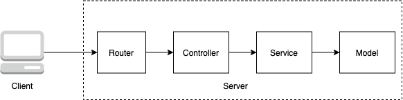

# Buổi 4
- Làm quen với MongoDB
- Project stucture. 
### Giới thiệu cơ sở dữ liệu
Các vấn đề khi sử dụng file
- Hiệu năng kém
- Không có cách tổ chức dữ liệu cố định và cách truy vấn hiệu quả
- Không thể hiện được mối liên hệ giữa các đối tượng

=> Cần một cơ chế để hạn chế các điều trên => Cơ sở dữ liệu

### Giới thiệu MongoDB
MongoDB là một hệ quản trị cơ sở dữ liệu không quan hệ (NoSQL)

MongoDB hoạt động theo cơ chế Client - Server
- Server: Nơi tập hợp dữ liệu và cài đặt một cơ chế quản trị
- Client: Kết nối tới Server qua giao thức mạng, gửi yêu cầu như thêm, đọc, sửa, xoá document, thêm collection,... Lưu ý: client trong project chính là app chạy code backend, ngoài ra client có thể là các tool như MongoDB Compass, Nosqlbooster, Robo3T,...

Trong thực tế, tuỳ phức tạp của dự án, Server cài MongoDB và Server chạy code backend có thể giống hoặc khác nhau

Một số khái niệm trong MongoDB
- Document: Cấu trúc tương tự như JSON, tương đương với một object trong JS
- Collection: Tập hợp các document cùng ngữ nghĩa ví dụ Posts, Comments, Users, tương đương với một array trong JS
- Database: Tập hợp các collection trong một dự án

### Áp dụng MongoDB vào project NodeJS
#### Thư viện mongoose
[mongoose](https://mongoosejs.com/docs/) là một thư viện giúp JS gọi các yêu cầu tới server MongoDB một cách dễ dàng hơn
Mặc dù có thư viện này, tuy nhiên cũng cần phải đọc doc MongoDB để hiểu cũng như nâng cao cách sử dụng các API của MongoDB cung cấp https://www.mongodb.com/

Để bắt đầu, ta cần tải thư viện
```
npm install mongoose --save
```
Các câu lệnh thường dùng

Kết nối tới database
```
const mongoose = require('mongoose');

mongoose.connect('mongodb://localhost:27017/test')
```
Các phương thức CRUD

Đầu tiên, để sử dụng được các phương thức CRUD, ta cần tạo model
```
const mongoose = require('mongoose');

const PostSchema = new mongoose.Schema(
  {
    imageUrl: {
      type: String,
      required: true
    },
    title: {
      type: String,
      required: true
    },
    description: String,
    createdBy: String
  },
  { timestamps: true } // createdAt, updatedAt
);
const PostModel = mongoose.model('Post', PostSchema);
```
Tham số đầu tiên của mongoose.model chính là tên collection được lưu trong MongoDB

Các phương thức CRUD: tham khảo thêm ở Docs

Create
```
  PostModel.create() // tạo 1 document
  PostModel.insertMany() // 
```
Read
```
  PostModel.findById() // tìm một
  PostModel.findOne() // tìm một
  PostModal.find() // tìm nhiều
```
Update
```
  PostModel.findByIdAndUpdate() // update một
  PostModel.findOneAndUpdate() // update một
  PostModel.updateMany() // update nhiều
```
Delete
```
  PostModel.findByIdAndDelete() // update một
  PostModel.findOneAndDelete() // update một
  PostModel.deleteMany() // update nhiều
```

### Project Structure
Chia các layer code để code dễ đọc, dễ bảo trì (Tưởng tượng 1 file index.js 1000 dòng xem :D). Việc bao nhiêu layer phụ thuộc vào leader và style công ty.



Mỗi layer có một trách nhiệm

Router: Gắn route của client với server

Controller: Lấy dữ liệu của client, chọn các service xử lý nghiệp vụ

Service: Xử lý nghiệp vụ

Model: Kết nối và thao tác cơ sở dữ liệu
